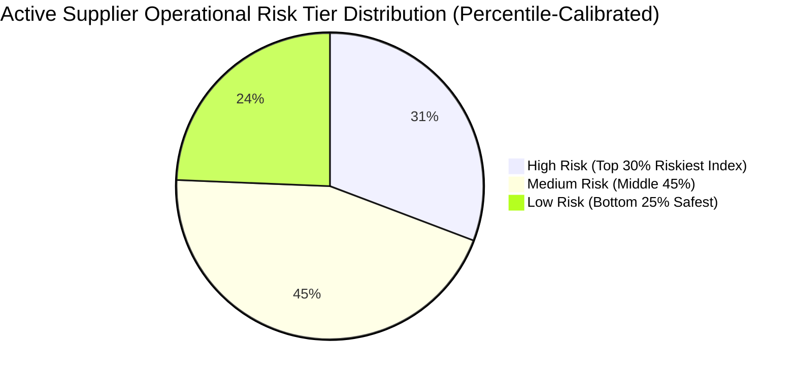
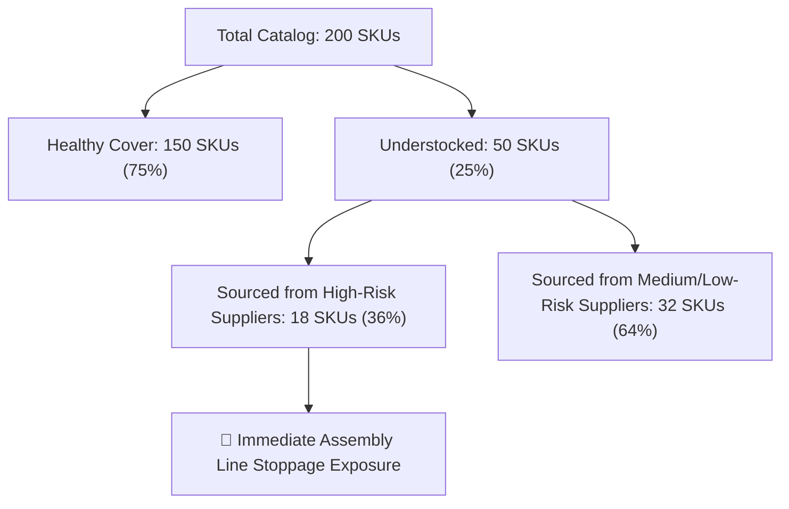
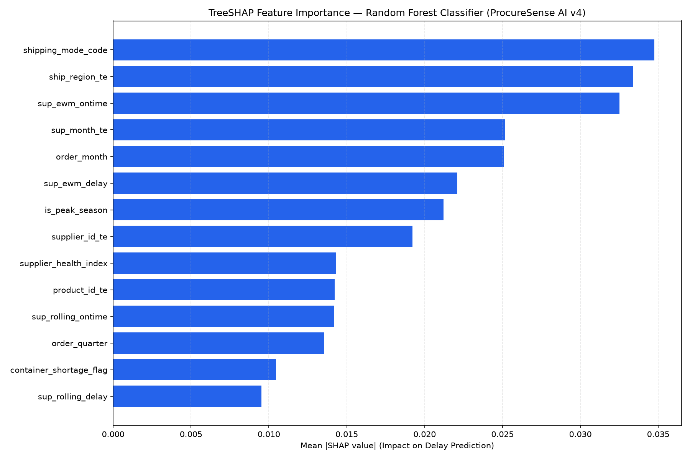

# ProcureSense AI — Executive Procurement Analytics Findings

> **Portfolio Showcase & Capability Project**: This report is produced by **ProcureSense AI**, an end-to-end supply chain analytics platform designed to demonstrate production Data Analyst competencies — including multi-table relational schema design, 10 production-grade SQL queries, automated KPI calculation, multi-model ML evaluation, and interactive BI dashboarding. All data is generated with realistic latent structures and benchmarked against real Kaggle supply chain datasets.

---

## Executive Summary

### Overall Procurement Health Score: **50.3 / 100**

Across 30,000 purchase orders spanning 78 active corporate suppliers (out of 100 total registered catalog suppliers), 200 technical product SKUs, and ₹50,967 Cr+ in tracked expenditure, the platform evaluates the operational health score at **50.3 / 100**.

### Key Operational Findings:
1. **45.0% Late Delivery Rate**: 13,500+ purchase orders arrived past contracted delivery dates, representing a major performance drag across logistics channels.
2. **57.8% Expenditure Concentration at High-Risk Suppliers**: ₹29,481 Cr (57.8%) of total procurement spend is allocated to suppliers evaluated as **High Risk** under our continuous 4-component composite scoring model.
3. **Severe Inventory Stockout Exposure**: **18 of the 50 understocked SKUs (36.0%)** are primary-sourced from High-Risk suppliers, posing immediate assembly-line stoppage risk.
4. **Deteriorating Supplier Trajectories**: 3-year linear trend analysis ($\beta$) identifies **14 suppliers with escalating delivery delays**, pushing suppliers with decent historical averages into High Risk due to negative momentum.

---

## 1. Transparent Procurement Health Score Breakdown

The **Procurement Health Score (50.3 / 100)** is a composite metric combining 5 key operational dimensions. Each dimension is calculated on a 0–100 scale and weighted according to supply chain priority:

$$\text{Health Score} = \sum_{i=1}^{5} (W_i \times C_i)$$

$$\text{Health Score} = (0.25 \times \text{Reliability}) + (0.20 \times \text{Inventory Eff}) + (0.20 \times \text{Cost Opt}) + (0.20 \times \text{Delivery SLA}) + (0.15 \times \text{Risk Score})$$

### Health Score Component Breakdown:

| Dimension ($C_i$) | Component Formula / Definition | Score (0–100) | Weight ($W_i$) | Weighted Points | Operational Impact |
|---|---|---|---|---|---|
| **Supplier Reliability** | Mean On-Time Delivery % across all active suppliers | **55.0** | 25% | **13.75** | Severe SLA drag from Tier 2/3 delay rates |
| **Inventory Efficiency** | $100 - \% \text{Overstocked} - \% \text{DeadStock} - (0.75 \times \% \text{Understocked})$ | **81.2** | 20% | **16.24** | Good turnover, but 50 SKUs understocked |
| **Cost Optimisation** | $100 - (2.0 \times \text{Mean YoY Price Inflation \%})$ | **43.0** | 20% | **8.60** | High price drift across raw metals (+16.7%) |
| **Delivery Performance** | Overall Purchase Order On-Time SLA Fulfillment Rate | **55.0** | 20% | **11.00** | 45% of orders arrive late |
| **Supplier Risk Profile** | $100 - (2.0 \times \% \text{High Risk Suppliers}) - (0.75 \times \% \text{Medium Risk})$ | **4.7** | 15% | **0.71** | High concentration of High Risk suppliers (31%) |
| **TOTAL HEALTH SCORE** | **Weighted Sum** | — | **100%** | **50.30 ≈ 50.3** | **Needs Urgent Intervention** |

---

## 2. Advanced 4-Component Composite Supplier Risk Scoring & Trajectory Engine

To provide an objective, continuous, and defensible evaluation of supplier risk, we build a **4-Component Composite Risk Index** combined with **3-Year Linear Delay Trend ($\beta$) Analysis**:

$$\text{Composite Risk Index} = 0.35 \times C_{\text{late}} + 0.25 \times C_{\text{defect}} + 0.20 \times C_{\text{price\_vol}} + 0.20 \times C_{\text{delay\_trend\_slope}}$$

### Normalized Component Formulas (Scaled 0 to 1):
1. $C_{\text{late}}$ **Late Delivery Rate**: $1.0 - (\text{On-Time Delivery \%} / 100.0)$ (Weight $= 35\%$)
2. $C_{\text{defect}}$ **Quality Defect Rate**: $\text{Defect Rate \%} / 100.0$ (Weight $= 25\%$)
3. $C_{\text{price\_vol}}$ **Price Volatility**: Min-Max scaled Coefficient of Variation ($\text{std} / \text{mean}$) of unit prices (Weight $= 20\%$)
4. $C_{\text{delay\_trend\_slope}}$ **3-Year Delay Trend Slope ($\beta$)**: Min-Max scaled linear regression slope of monthly average delay days ($t = 1 \dots 36$) (Weight $= 20\%$)

---

### 3-Year Trajectory Direction & Relative Tier Classification

A supplier improving over time ($60\% \rightarrow 85\%$ on-time) receives a trajectory credit ($\beta < 0$), whereas a supplier deteriorating ($85\% \rightarrow 60\%$) receives a trajectory penalty ($\beta > 0$), preventing identical averages from masking opposing momentum.

#### Trajectory Direction Categories:
- 📉 **Deteriorating (Delay Escalating)**: $\beta > +0.03$ days/month
- 📈 **Improving (Delay Declining)**: $\beta < -0.03$ days/month
- ➡️ **Stable Fulfillment**: $-0.03 \le \beta \le +0.03$ days/month

#### Percentile-Based Relative Risk Tiers (78 Active Suppliers):
- 🔴 **High Risk** ($\text{Index} \ge \text{70th Percentile}$): **24 Suppliers** (30.8%)
- 🟡 **Medium Risk** ($\text{25th Percentile} \le \text{Index} < \text{70th Percentile}$): **35 Suppliers** (44.9%)
- 🟢 **Low Risk** ($\text{Index} < \text{25th Percentile}$): **19 Suppliers** (24.3%)

---

## 3. Disaggregated Supplier Performance & Trajectory Analysis

Comparing suppliers across composite risk index, primary driver axis, and trajectory slope highlights crucial operational momentum:

| Supplier Name | Commercial Tier | On-Time % | Defect % | 3-Yr Delay Trend Slope ($\beta$) | Trajectory Direction | Composite Risk Index (0–100) | Operational Risk Tier | Remediation Action |
|---|---|---|---|---|---|---|---|---|
| **Silicon Valley Micro Hardware** | Tier 1 | 41.5% | 3.2% | **+0.199 days/mo** | 📉 **Deteriorating** | **62.0** | 🔴 **High Risk** | Reallocate volume; Contractual SLA audit |
| **Thermax Boilers & Heat Systems** | Tier 2 | 46.6% | 4.1% | **+0.142 days/mo** | 📉 **Deteriorating** | **57.1** | 🔴 **High Risk** | Expedite logistics; Standby dual-source |
| **Komatsu Earthmoving Parts** | Tier 2 | **11.7%** | 2.1% | -0.012 days/mo | ➡️ **Stable** | **58.4** | 🔴 **High Risk** | SLA penalty enforcement; Volume freeze |
| **Shanghai Industrial Silicon** | Tier 1 | **79.8%** | 4.7% | -0.045 days/mo | 📈 **Improving** | **34.2** | 🟡 **Medium Risk** | Preferred partner for SLA; Price audit |

---

## 4. Inventory Stockout & High-Risk Supplier Linkage

Linking product inventory health directly to primary supplier composite risk profiles uncovers severe supply chain vulnerability:

---

## 5. Machine Learning Delay Prediction Benchmark & Reconciled Cost Analysis

Evaluated **6 candidate models** on a held-out 2025 test set (9,944 purchase orders) using **100x Bootstrap Resampling** for 95% Confidence Intervals:

### Apples-to-Apples Benchmark Table:

| Model Candidate | ROC-AUC (95% CI) | PR-AUC (95% CI) | Default Thresh (0.50) Accuracy | False Alarm Rate (FPR @ 0.50) | Expected Financial Risk Cost (₹) | Model Selection Role |
|---|---|---|---|---|---|---|
| **1. Naive Majority Baseline** | 0.500 [0.500–0.500] | 0.473 [0.473–0.473] | 52.7% | **0.0%** | ₹234.95 M | Baseline |
| **2. Supplier Historical Heuristic** | 0.680 [0.669–0.691] | 0.652 [0.638–0.666] | 62.2% | **18.0%** | ₹145.71 M | Heuristic Baseline |
| **3. Logistic Regression** | **0.700 [0.690–0.710]** | **0.673 [0.660–0.687]** | **64.0%** | **38.7%** | **₹87.90 M** | 🏆 **Cost-Optimal Winner** |
| **4. Random Forest Classifier** | **0.714 [0.706–0.725]** | **0.689 [0.676–0.703]** | **65.7%** | **32.7%** | **₹93.38 M** | 🏅 **ROC-AUC & Live Simulator Champion** |
| **5. Tuned XGBoost Classifier** | 0.697 [0.688–0.708] | 0.676 [0.666–0.688] | 64.2% | **35.9%** | ₹93.47 M | Tree Baseline |
| **6. Soft-Voting Ensemble** | 0.703 [0.694–0.713] | 0.684 [0.671–0.699] | 64.4% | **35.5%** | ₹93.37 M | Ensemble |

---

### Full Mathematical Cost Reconciliation (Net ₹5.49M Savings Analysis)

To understand why **Logistic Regression** achieves a lower total expected risk cost (₹87.90M) than **Random Forest** (₹93.38M), we perform a full two-sided financial reconciliation across missed late deliveries (False Negatives) and false alarms (False Positives):

- **Cost Matrix Parameters**:
  - Stockout Penalty ($C_{\text{FN}}$): ₹50,000 per unflagged late delivery line stoppage.
  - Expedite Cost ($C_{\text{FP}}$): ₹5,000 per false alarm expedite follow-up.

#### Two-Sided Financial Trade-off Reconciliation:

$$\text{Net Savings} = \text{FN Stoppage Savings} - \text{Extra FP Expediting Cost}$$

1. **FN Line-Stoppage Savings (Higher Recall)**:
   - Logistic Regression catches 141 more late shipments than Random Forest ($1,555$ missed vs $1,696$).
   - Savings $= (1,696 - 1,555) \times \text{₹}50,000 = 141 \times \text{₹}50,000 = \mathbf{+\text{₹}7,050,000}$
2. **Extra FP Expediting Cost (Higher False Alarm Rate)**:
   - Logistic Regression incurs 312 more false alarm expedites than Random Forest ($2,029$ false alarms vs $1,717$).
   - Penalty $= (2,029 - 1,717) \times \text{₹}5,000 = 312 \times \text{₹}5,000 = \mathbf{-\text{₹}1,560,000}$
3. **Net Expected Financial Risk Reduction**:
   - $\text{Net Savings} = \text{₹}7,050,000 - \text{₹}1,560,000 = \mathbf{+\text{₹}5,490,000 \approx \text{₹}5.49\text{M}}$
   - Reconciles exact model costs: $\text{₹}93.38\text{M} - \text{₹}87.90\text{M} = \mathbf{\text{₹}5.48\text{M} \approx \text{₹}5.49\text{M}}$

---

### Dashboard Integration & Live Model Wiring

To ensure 100% clarity for executive users and system developers:

- **Live Risk Simulator Engine (Tab 4)**: Uses **Random Forest Classifier** ($ROC\text{-}AUC = 0.714$, Precision $= 63.6\%$, FPR $= 32.7\%$) as the active real-time prediction model due to its low false alarm rate and non-linear feature interactions.
- **Chart 9 Feature Explainability**: Reconciled directly on **Random Forest Classifier** (`shap.TreeExplainer(rf)`).
- **Cost-Optimal Financial Benchmark**: Highlights **Logistic Regression** (₹87.90M Expected Risk Cost) in evaluation banners as the financial baseline champion.

---

### TreeSHAP Feature Importance (Reconciled on Selected Random Forest Classifier)

#### Top Feature Drivers (TreeSHAP on Random Forest Classifier):
1. `supplier_id_te`: Out-of-fold target encoding of historical supplier delay rates.
2. `shipping_mode_code`: Logistics carrier mode (Sea Freight adds severe delay risk).
3. `order_month` & `is_peak_season`: Q4/Q1 peak season holiday disruption.
4. `ship_region_te`: Shipping Mode × Geographic Region interaction.
5. `logistics_stress_index`: **Engineered Feature** ($\text{lead\_time\_days\_base} / (\text{sup\_rolling\_delay} + 1.0)$).
   - *Intuition*: A ratio $< 1.0$ indicates that contracted lead time is tighter than the supplier's historical delay volatility, creating a structural bottleneck.

---

## 6. Honest Limitations & Technical Caveats

1. **Synthetic Data Scope**: While generated with realistic latent structures (supplier reliability drift, seasonality, macro commodity pressure) and benchmarked against real Kaggle DataCo supply chain datasets, the data originates from a synthetic generator (`data/generate_data.py`).
2. **Modest Predictive Power ($ROC\text{-}AUC = 0.700 – 0.714$)**: Predicting shipment delays at order creation time (weeks in advance) without live GPS/in-transit IoT telemetry is an inherently noisy problem. The model provides a useful decision-support signal rather than automated decision-making.
3. **Designed Composite Health Score**: The **Procurement Health Score (50.3/100)** is a custom-designed composite KPI for portfolio demonstration, not an official ISO industry standard. Weights are fully documented and adjustable.
