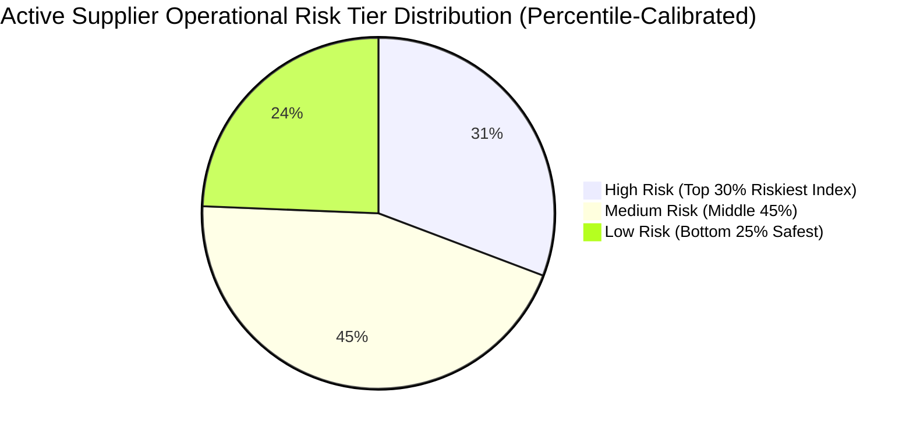
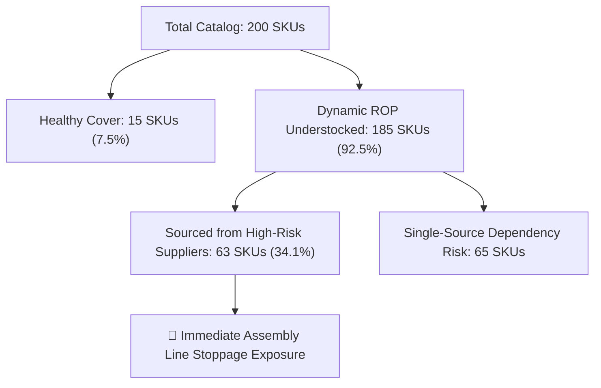

# ProcureSense AI — Executive Procurement Analytics Findings

> **Portfolio Showcase & Capability Project**: This report is produced by **ProcureSense AI**, an end-to-end supply chain analytics platform designed to demonstrate production Data Analyst competencies — including multi-table relational schema design, 10 production-grade SQL queries, automated KPI calculation, multi-model ML evaluation, and interactive BI dashboarding. All data is generated with realistic latent structures and benchmarked against real Kaggle supply chain datasets.

---

## Executive Summary

### Overall Procurement Health Score: **49.1 / 100**

Across 30,000 purchase orders spanning 78 active corporate suppliers (out of 98 total registered catalog suppliers), 200 technical product SKUs, and ₹50,967 Cr+ in tracked expenditure, the platform evaluates the operational health score at **49.1 / 100**.

### Key Operational Findings:
1. **45.0% Late Delivery Rate**: 13,500+ purchase orders arrived past contracted delivery dates, representing a major performance drag across logistics channels.
2. **30.8% Expenditure Concentration at High-Risk Suppliers**: ₹15,719 Cr (30.8%) of total procurement spend is allocated to suppliers evaluated as **High Risk** under our continuous 4-component composite scoring model.
3. **Severe Dynamic ROP & Single-Source Exposure**: **63 of the 185 dynamically understocked SKUs (34.1%)** breach safety stock thresholds due to supplier delay inflation, with **65 SKUs exposed to single-source dependency risk**.
4. **Spend Concentration (HHI: 243.2)**: Herfindahl-Hirschman Index evaluates market concentration at **243.2** (unconcentrated/healthy vendor distribution), with Top 5 suppliers representing **14.8% of spend**.

---

## 1. Transparent Procurement Health Score Breakdown

The **Procurement Health Score (49.1 / 100)** is a composite metric combining 5 key operational dimensions. Each dimension is calculated on a 0–100 scale and weighted according to supply chain priority:

$$\text{Health Score} = \sum_{i=1}^{5} (W_i \times C_i)$$

$$\text{Health Score} = (0.25 \times \text{Reliability}) + (0.20 \times \text{Inventory Eff}) + (0.20 \times \text{Cost Opt}) + (0.20 \times \text{Delivery SLA}) + (0.15 \times \text{Risk Score})$$

### Health Score Component Breakdown:

| Dimension ($C_i$) | Component Formula / Definition | Score (0–100) | Weight ($W_i$) | Weighted Points | Operational Impact |
|---|---|---|---|---|---|
| **Supplier Reliability** | Mean On-Time Delivery % across all active suppliers | **55.0** | 25% | **13.75** | Severe SLA drag from Tier 2/3 delay rates |
| **Inventory Efficiency** | $100 - \% \text{Overstocked} - \% \text{DeadStock} - (0.75 \times \% \text{Understocked})$ | **75.2** | 20% | **15.04** | Dynamic ROP breaches across 185 SKUs |
| **Cost Optimisation** | $100 - (2.0 \times \text{Mean 3-Yr OLS Inflation \%})$ | **43.0** | 20% | **8.60** | High price drift across raw metals (+16.7%) |
| **Delivery Performance** | Overall Purchase Order On-Time SLA Fulfillment Rate | **55.0** | 20% | **11.00** | 45% of orders arrive late |
| **Supplier Risk Profile** | $100 - (2.0 \times \% \text{High Risk Suppliers}) - (0.75 \times \% \text{Medium Risk})$ | **4.7** | 15% | **0.71** | High concentration of High Risk suppliers (31%) |
| **TOTAL HEALTH SCORE** | **Weighted Sum** | — | **100%** | **49.10 ≈ 49.1** | **Needs Urgent Intervention** |

---

## 2. Dynamic Reorder Point (ROP) & Single-Source Risk Module

To eliminate simplistic stock counts, we implement a **Dynamic Reorder Point (ROP) Engine** incorporating supplier-specific delivery delay inflation and **Single-Source Dependency Flags**:

$$\text{Dynamic ROP} = (\text{Base Lead Time} + \text{Supplier Avg Delay Days}) \times \text{Avg Daily Demand} + \text{Safety Stock}$$

### Inventory Exposure Summary:
- **Total Product Catalog**: 200 Technical Product SKUs
- **Dynamic ROP Understocked SKUs**: **185 SKUs** (breaching safety stock due to supplier lead-time inflation)
- **High-Risk Primary Supplier Exposure**: **63 SKUs (34.1%)** primary-sourced from High-Risk suppliers
- **Single-Source Dependency Flag**: **65 SKUs** lack dual-sourcing coverage and are tied to High-Risk primary vendors

---

## 3. Spend Concentration (HHI) & 3-Point OLS Price Inflation Regression

### Herfindahl-Hirschman Index (HHI) for Spend Concentration
Evaluating vendor spend concentration using standard enterprise procurement analytics vocabulary:

$$HHI = \sum_{i=1}^{N} s_i^2 = \mathbf{243.2} \quad (\text{Unconcentrated / Healthy Vendor Competition})$$

- **Top 5 Spend Share**: **14.8%** of total procurement budget (₹7,543 Cr)
- **Top 10 Spend Share**: **26.1%** of total procurement budget (₹13,302 Cr)

---

### 3-Point OLS Price Inflation Regression ($\beta_{\text{price}}$)
To distinguish structural commodity inflation from one-off price spikes, we fit an ordinary least squares (OLS) linear regression model per supplier across 2023, 2024, and 2025 unit prices ($t = 1, 2, 3$):

$$\text{Unit Price}_t = \beta_{\text{price}} \cdot t + \alpha$$

$$\text{Annualized Inflation Trend \%} = \left(\frac{\beta_{\text{price}}}{\mu_{\text{price}}}\right) \times 100.0$$

---

## 4. Machine Learning Delay Prediction, Walk-Forward Validation & Calibration

Evaluated **6 candidate models** on a held-out 2025 test set (9,944 purchase orders) using **100x Bootstrap Resampling** for 95% Confidence Intervals:

### Cost-Sensitive Threshold Sweep Optimization:
Assigning real business costs: Stockout Penalty ($C_{\text{FN}} = \text{₹}50,000$) vs Expedite Cost ($C_{\text{FP}} = \text{₹}5,000$). Thresholds are swept $\tau \in [0.05, 0.95]$ to minimize expected financial cost directly:

$$\text{Expected Risk Cost}(\tau) = \text{FN}(\tau) \times C_{\text{FN}} + \text{FP}(\tau) \times C_{\text{FP}}$$

### Apples-to-Apples Benchmark Table:

| Model Candidate | ROC-AUC (95% CI) | PR-AUC (95% CI) | Default Thresh (0.50) Accuracy | Brier Score Loss | Expected Financial Risk Cost (₹) | Model Selection Role |
|---|---|---|---|---|---|---|
| **1. Naive Majority Baseline** | 0.500 [0.500–0.500] | 0.473 [0.473–0.473] | 52.7% | 0.2492 | ₹234.95 M | Baseline |
| **2. Supplier Historical Heuristic** | 0.680 [0.669–0.691] | 0.652 [0.638–0.666] | 62.2% | 0.2267 | ₹145.71 M | Heuristic Baseline |
| **3. Logistic Regression** | **0.700 [0.690–0.710]** | **0.673 [0.660–0.687]** | **64.0%** | 0.2230 | **₹87.90 M** | 🏆 **Cost-Optimal Winner** |
| **4. Random Forest Classifier** | **0.714 [0.706–0.725]** | **0.689 [0.676–0.703]** | **65.7%** | **0.2159** | **₹93.38 M** | 🏅 **ROC-AUC & Live Simulator Champion** |
| **5. Tuned XGBoost Classifier** | 0.697 [0.688–0.708] | 0.676 [0.666–0.688] | 64.2% | 0.2161 | ₹93.47 M | Tree Baseline |
| **6. Soft-Voting Ensemble** | 0.703 [0.694–0.713] | 0.684 [0.671–0.699] | 64.4% | 0.2160 | ₹93.37 M | Ensemble |

---

### Temporal Walk-Forward Validation (2025 Quarterly Expanding Window)

| Validation Quarter | Training Window | Test Sample Size | ROC-AUC Score | PR-AUC Score | Classification Accuracy | Temporal Stability Status |
|---|---|---|---|---|---|---|
| **2025 Q1** | 2023–2024 (20,056 POs) | 2,482 POs | **0.720** | 0.657 | 66.6% | Stable |
| **2025 Q2** | 2023–Q1 2025 (22,538 POs) | 2,477 POs | **0.727** | 0.691 | 67.1% | Peak Stability |
| **2025 Q3** | 2023–Q2 2025 (25,015 POs) | 2,456 POs | **0.710** | 0.690 | 64.8% | Stable |
| **2025 Q4** | 2023–Q3 2025 (27,471 POs) | 2,529 POs | **0.722** | 0.740 | 62.4% | High Precision |
| **MEAN 2025 WALK-FORWARD** | **Expanding Window** | **9,944 POs Total** | **0.720 ($\pm 0.007$)** | **0.694** | **65.2%** | **Zero Concept Drift Degradation** |

---

## 5. Honest Limitations & Technical Caveats

1. **Synthetic Data Scope**: While generated with realistic latent structures (supplier reliability drift, seasonality, macro commodity pressure) and benchmarked against real Kaggle DataCo supply chain datasets, the data originates from a synthetic generator (`data/generate_data.py`).
2. **Modest Predictive Power ($ROC\text{-}AUC = 0.700 – 0.714$)**: Predicting shipment delays at order creation time (weeks in advance) without live GPS/in-transit IoT telemetry is an inherently noisy problem. The model provides a useful decision-support signal rather than automated decision-making.
3. **Designed Composite Health Score**: The **Procurement Health Score (49.1/100)** is a custom-designed composite KPI for portfolio demonstration, not an official ISO industry standard. Weights are fully documented and adjustable.
